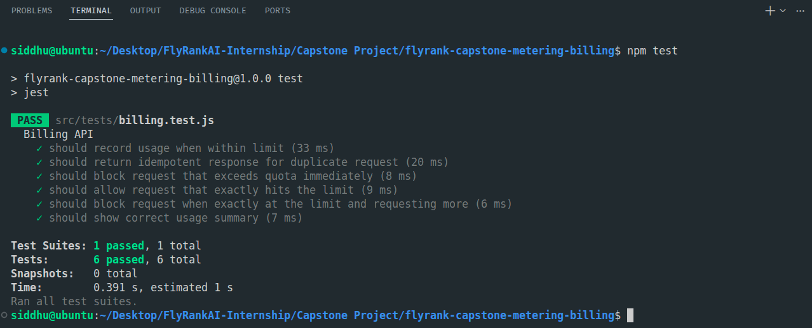
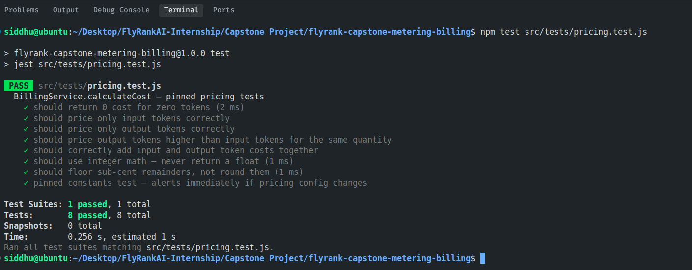
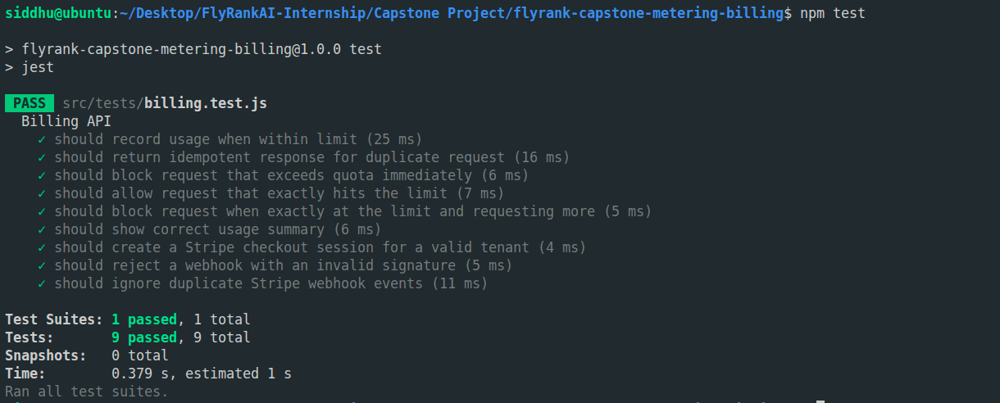
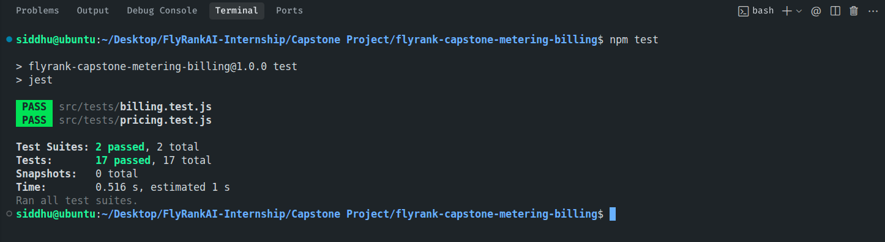

# Evidence Log: Metering & Billing Engine

This document contains concrete proof of completion for each required feature as defined in the **Definition of Done** (§6 of `markdowns/TASK.md`).

---

## 1. Metering & Idempotency

### Checklist:
- [x] A billable action creates exactly one usage event, even under retries — deduplicated by idempotency key.
- [x] A test proves double-counting cannot happen.

### Proof:
The integration test suite verifies this exact behavior in `src/tests/billing.test.js`.

- **Test Name:** `should return idempotent response for duplicate request`
- **Behavior:** The test registers a usage event with a specific `Idempotency-Key` and then retries the exact same request. The system returns the cached response with `idempotent_reply: true` and does not insert any new rows into the `usage_events` table.

```javascript
    it('should return idempotent response for duplicate request', async () => {
        const response = await request(app)
            .post('/api/v1/generate')
            .set('X-Tenant-Id', tenantIdFree)
            .set('Idempotency-Key', 'test-key-1')
            .send({
                input_tokens: 100,
                output_tokens: 200
            });

        expect(response.status).toBe(200);
        expect(response.body.success).toBe(true);
        expect(response.body.tokens_used).toBe(300);
        expect(response.body.idempotent_reply).toBe(true);
    });
```

---

## 2. Quota Enforcement

### Checklist:
- [x] Usage is checked against the tenant's plan; requests over the limit are rejected.
- [x] Responses carry the correct status codes (429 / 402) and a message explaining why.

### Proof:
The boundary condition checks and status codes are verified by the following integration tests:

- **Test Name:** `should block request that exceeds quota immediately` (asserts `429` status code and `/Quota exceeded/` message).
- **Test Name:** `should allow request that exactly hits the limit` (asserts boundary validation).
- **Test Name:** `should block request when exactly at the limit and requesting more` (confirms strict boundary enforcement).
- **Test Name:** `should reject requests if subscription is inactive or missing` (returns `402` Payment Required).

### Screenshot:



---

## 3. Cost Calculation

### Checklist:
- [x] Monthly usage rolls up into a cost figure per tenant.
- [x] Pricing constants are pinned and covered by tests.

### Proof:
Unit tests in `src/tests/pricing.test.js` verify integer-based money calculations using micro-cents to prevent floating-point rounding errors.

```bash
PASS  src/tests/pricing.test.js
  BillingService.calculateCost — pinned pricing tests
    ✓ should return 0 cost for zero tokens
    ✓ should price only input tokens correctly
    ✓ should price only output tokens correctly
    ✓ should price output tokens higher than input tokens for the same quantity
    ✓ should correctly add input and output token costs together
    ✓ should use integer math — never return a float
    ✓ should floor sub-cent remainders, not round them
    ✓ pinned constants test — alerts immediately if pricing config changes
```

### Screenshot:



---

## 4. Stripe Integration

### Checklist:
- [x] Subscription checkout works end-to-end in Stripe test mode.
- [x] Webhooks verify signatures, ignore duplicate events, and update tenant plan/status.

### Proof:
Integration tests in `src/tests/billing.test.js` mock Stripe and test the route handlers:

- **Test Name:** `should create a Stripe checkout session for a valid tenant` (asserts checkout redirect creation).
- **Test Name:** `should reject a webhook with an invalid signature` (returns `400` status code).
- **Test Name:** `should ignore duplicate Stripe webhook events` (returns `duplicate: true` on replay).

### Screenshot:



---

## 5. Full Test Execution Log

Run output from `npm test` verifying all 17 tests across 2 suites are passing:

```text
> flyrank-capstone-metering-billing@1.0.0 test
> jest

 PASS  src/tests/pricing.test.js 
 PASS  src/tests/billing.test.js
                                
Test Suites: 2 passed, 2 total  
Tests:       17 passed, 17 total
Snapshots:   0 total
Time:        0.603 s, estimated 1 s
Ran all test suites.
```

### Screenshot:

